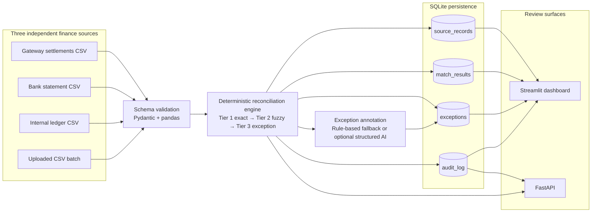
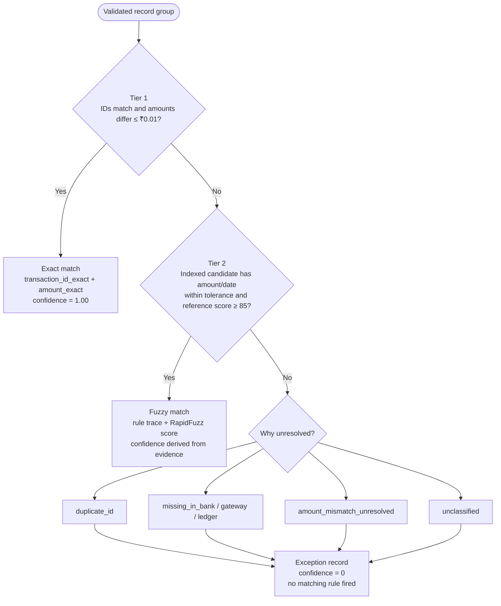
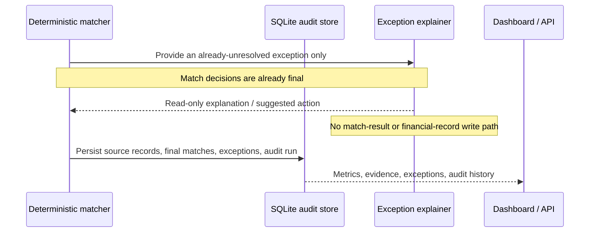

# Reconcio

> **An explainable, audit-ready 3-way reconciliation engine for finance operations.**

Reconcio reconciles payment-gateway settlements, bank statements, and internal ledgers in a single batch. It does more than report a match percentage: it makes deterministic, explainable matching decisions, surfaces every unresolved record with an actionable reason, and preserves an append-only audit trail for review.

Built for the **Razorpay Buildathon — AI Finance Controller** track.

## Why this matters

Manual reconciliation breaks down precisely where finance teams need confidence most: settlement lags, fee deductions, rounding, duplicate IDs, and missing reports. Spreadsheet lookups either miss valid transactions or silently force incorrect matches.

Reconcio separates outcomes honestly:

- **Exact match** — identical transaction ID and amount across all three sources.
- **Fuzzy match** — amount/date tolerance and RapidFuzz reference evidence support the match.
- **Exception** — the system cannot justify a match, so it explicitly asks for review.

## What a reviewer can verify in minutes

| Capability | Evidence in the product |
| --- | --- |
| Deterministic 3-way matching | Tier 1 exact and Tier 2 fuzzy records are separately inspectable. |
| Explainable fuzzy decisions | Every Tier 2 match exposes amount difference, rule trace, RapidFuzz score, and confidence. |
| Honest exception handling | Missing sources, duplicates, and out-of-tolerance values are never silently dropped. |
| AI safety | The optional AI layer only annotates existing exceptions; it cannot alter records or matches. |
| Auditability | SQLite stores source records, match results, exceptions, and an append-only run history. |
| Usability | Run the seeded demo or upload all three validated CSVs from the dashboard. |
| Scale evidence | A 7,722-record stress run is persisted in the same audit log as the live demo. |

---

## Architecture

### System design



### Reconciliation decision flow



### Trust boundary: matching is deterministic; AI is read-only



## Matching model

| Tier | Decision rule | Evidence shown to reviewer |
| --- | --- | --- |
| **Tier 1 — exact** | Same transaction ID in all sources; amounts equal within ₹0.01. | `transaction_id_exact`, `amount_exact`, confidence `1.00`. |
| **Tier 2 — fuzzy** | Indexed candidates must satisfy amount tolerance (default ±₹5 or 2% fee tolerance), date window (default ±3 days), and RapidFuzz reference/payer similarity (default ≥85). | Amount difference, `amount_tolerance`, `date_tolerance`, `fuzzy_reference_match:rapidfuzz_score=…`, confidence. |
| **Tier 3 — exception** | No deterministic rule supports a defensible match. | A specific reason code and `No matching rule fired`. |

Tier 2 candidate lookup is indexed by normalized reference and transaction ID, avoiding a full 3-way Cartesian comparison when processing larger batches.

## AI safety and explainability

**The matching engine makes 100% of match decisions before the AI layer runs.** The optional explainer cannot change a `match_result`, mutate financial data, or move money.

- With `OPENAI_API_KEY` configured, exceptions may receive schema-validated structured AI annotations: `reason_category`, `explanation`, `suggested_action`, and `confidence`.
- Without a key, every exception receives a transparent `[Rule-based]: …` explanation; the dashboard never displays a blank explanation or a vague status in place of one.
- If an AI request fails, Reconcio logs the error and safely falls back to the deterministic explanation.

## Demo evidence: throughput, accuracy, and honest exceptions

The figures below are **real, non-cherry-picked, persisted runs**. End-to-end duration includes CSV loading, deterministic reconciliation, rule-based exception explanations, and SQLite result writes.

### THROUGHPUT

| Dataset | Audit log proof | End-to-end duration | Throughput |
| --- | --- | ---: | ---: |
| Seeded live demo — 193 source records | Audit ID `77` | `0.092865s` | `2,078.29 records/sec` |
| Stress dataset — 7,722 source records | Audit ID `78` | `0.605719s` | `12,748.49 records/sec` |

### MEASURED ACCURACY

| Dataset | Match rate | Tier 1 exact | Tier 2 fuzzy |
| --- | ---: | ---: | ---: |
| Seeded live demo | `90.91%` | `55` (`83.33%`) | `5` (`7.58%`) |
| Stress dataset | `91.13%` | `2,210` (`83.74%`) | `195` (`7.39%`) |

### HONEST EXCEPTION LIST

| Dataset | Duplicate ID | Amount mismatch unresolved | Missing in gateway | Missing in bank |
| --- | ---: | ---: | ---: | ---: |
| Seeded live demo | 1 | 1 | 1 | 2 |
| Stress dataset | 39 | 39 | 39 | 78 |

The missing and unresolved records are intentional. Reconcio is designed to surface uncertainty instead of inflating its match rate with forced matches.

### Cash-control signal

The dashboard also shows **Unreconciled cash exposure**: the total value represented by exceptions awaiting review. It deliberately does **not** claim to be a cash-balance forecast; it is the amount whose reconciliation status needs finance-ops attention before downstream cash reporting can be trusted.

## Failure recovery: the 2 AM metrics correction

During testing, a fast standalone reconciliation measurement did not agree with the duration recorded in the SQLite audit trail. That was a measurement-boundary bug: the fast path timed only the matching work while the real dashboard workflow also loads files, creates explanation annotations, and persists evidence. The timing was corrected to cover the complete end-to-end pipeline, and the README now reports only throughput derived from persisted audit-log rows. This is intentional: Reconcio optimizes for defensible finance metrics, not flattering numbers.

## Submission proof

- **Repository:** this README, the architecture diagrams, source code, and test suite are the technical evidence.
- **Five-minute video:** record one seeded dashboard run; show the tier filter, exception table, audit trail, and the 7,722-record stress-test evidence. A suggested narration is in [docs/submission-proof.md](docs/submission-proof.md).
- **Failure recovery:** use the metrics-correction story above to demonstrate that auditability informed a real engineering decision.

## Run locally

### 1. Create the environment

```powershell
python -m venv .venv
.\.venv\Scripts\python.exe -m pip install -r requirements.txt
```

> If PowerShell activation is inconvenient, every command below works directly through `.\.venv\Scripts\python.exe`.

### 2. Generate the default demo data

```powershell
.\.venv\Scripts\python.exe data\generate_synthetic_data.py
```

### 3. Run the dashboard

```powershell
.\.venv\Scripts\python.exe -m streamlit run dashboard\app.py
```

Open the local URL shown by Streamlit, usually `http://localhost:8501`, then click **Run Reconciliation**.

### 4. Run the API

```powershell
.\.venv\Scripts\python.exe -m uvicorn api.main:app --reload
```

Open interactive API documentation at `http://127.0.0.1:8000/docs`.

### 5. Run tests

```powershell
.\.venv\Scripts\python.exe -m pytest -q
```

## Use your own CSVs

The dashboard’s **Upload CSV batch (optional)** section accepts one CSV for each source. Uploaded files are validated before matching and are processed in memory; only the reconciliation results and audit evidence are persisted.

Every CSV must contain these columns:

```text
transaction_id,amount,transaction_date,reference,payer_name,payment_method
```

Malformed inputs receive clear errors, for example: `gateway CSV is missing required column(s): amount.`

## API surface

| Endpoint | Purpose |
| --- | --- |
| `POST /reconcile` | Reconcile the seeded default CSV files. |
| `POST /reconcile-upload` | Accept multipart `gateway_file`, `bank_file`, and `ledger_file` CSVs; validate and reconcile them. |
| `GET /report/latest` | Return the most recent API-process result. |
| `GET /runs` | Return the persisted audit history. |

## Reproduce the evidence

Run the seeded demo with deterministic rule-based exception explanations:

```powershell
$env:OPENAI_API_KEY=''
.\.venv\Scripts\python.exe -c "from src.pipeline import run_reconciliation; print(run_reconciliation(enable_ai=True)['metrics'])"
```

Generate and reconcile the separate 40× stress dataset without overwriting the demo files:

```powershell
.\.venv\Scripts\python.exe data\generate_synthetic_data.py --scale 40
$env:OPENAI_API_KEY=''
.\.venv\Scripts\python.exe -c "from src.pipeline import run_reconciliation; print(run_reconciliation(data_dir='data/large_scale_40', enable_ai=True)['metrics'])"
```

Each command creates an append-only audit entry in `reconcio.db`. The seeded generator makes repeatable outcomes intentional—not a cache artifact.

## Repository map

```text
reconcio/
├── api/main.py                    # FastAPI endpoints, including multipart CSV upload
├── dashboard/app.py               # Streamlit reviewer workflow
├── data/
│   ├── generate_synthetic_data.py # Seeded demo + --scale stress-data generator
│   └── large_scale_40/            # Separate 7,722-record stress dataset
├── src/
│   ├── matcher.py                 # Tier 1 / Tier 2 / Tier 3 deterministic engine
│   ├── pipeline.py                # Validation, orchestration, timing, persistence
│   ├── db.py                      # SQLite models and append-only audit trail
│   ├── explainer.py               # Read-only structured AI + rule-based fallback
│   ├── metrics.py                 # Accuracy, value, and throughput metrics
│   ├── exceptions.py              # Exception reason helpers
│   └── models.py                  # Pydantic input/output contracts
├── tests/                         # Matcher, metric, database, and pipeline tests
└── docs/architecture.md           # Concise architecture reference
```

## Current limitations and next steps

- **Assignment quality:** Tier 2 uses deterministic greedy selection after indexed candidate generation. A production rollout should add global assignment for dense ambiguous groups.
- **Human operations:** Add reviewer identity, resolution states, comments, and approval workflows for exceptions.
- **Financial precision:** Use `Decimal` and currency-specific rules rather than floating-point amounts in a production ledger.
- **Data integration:** Add direct gateway/bank connectors, schema mapping, incremental imports, and reconciliation cut-off windows.
- **Production controls:** Upgrade SQLite to PostgreSQL, add RBAC, encryption, immutable external audit storage, monitoring, and asynchronous batch workers.

---

**Reconcio’s design principle:** match only when the evidence is defensible; otherwise create an auditable exception for a human to review.
