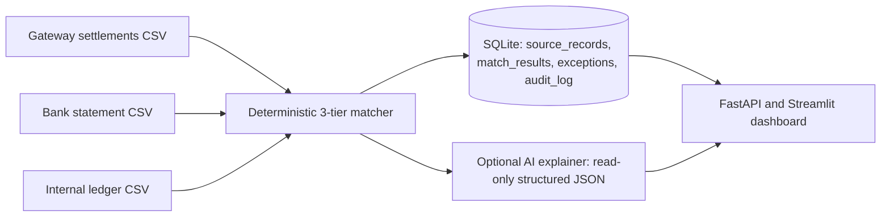

# Reconcio

Finance teams often reconcile payment-gateway settlements, bank statements, and internal ledgers by hand. Small settlement delays, fee deductions, rounding differences, duplicate identifiers, and missing records make exact spreadsheet lookups unreliable; Reconcio processes all three sources in one batch, makes explainable deterministic matches, and surfaces the records that genuinely need investigation.

## Architecture



The matcher first finds exact three-way matches, then uses configured amount/date tolerances plus RapidFuzz reference similarity, and finally emits a categorized exception for every unresolved record. SQLite keeps all ingested records, match decisions, exceptions, and an append-only audit entry per run.

## AI Safety Principle

The deterministic matcher makes 100% of matching decisions before the AI layer runs. The optional AI explainer has no write access to match results or financial data: it can only annotate an already-created exception with a schema-validated explanation and suggested action. It cannot alter a record, change a match decision, or move money.

## Run locally

```powershell
python -m venv .venv
.\.venv\Scripts\Activate.ps1
pip install -r requirements.txt
python data\generate_synthetic_data.py
uvicorn api.main:app --reload
```

In a second terminal, with the environment activated:

```powershell
streamlit run dashboard\app.py
pytest -q
```

Use `POST /reconcile` to run a batch, `GET /report/latest` for the latest in-process response, and `GET /runs` for persisted audit history. Copy `.env.example` to `.env` and set `OPENAI_API_KEY` only if optional AI annotations are wanted; the core pipeline does not require it.

## Sample output

This was produced by a real local run of the generated batch (65 gateway, 63 bank, and 65 ledger source records):

```text
matched_count: 61 (92.42%)
tier_1_count: 55
tier_2_count: 6
value_matched: ₹414,621.63
value_in_exceptions: ₹35,204.58
exception_count_by_reason:
  duplicate_id: 1
  missing_in_bank: 2
  missing_in_gateway: 1
processing_time_seconds: 0.163478
records_per_second: 1180.58
```

An append-only `audit_log` record was also created for that run with `batch_size=193`, `match_rate=92.42`, and `duration_seconds=0.163478`.

## Known limitations / next steps

- The current fuzzy pass is greedy; a production deployment should use global assignment and human review queues for close candidates.
- CSV adapters are intentionally simple; production connectors would validate gateway/bank-specific schemas and incremental imports.
- SQLite is ideal for the local demo. A multi-user production system would add access control, encrypted secrets, a managed database, and immutable external audit storage.
- The optional AI explainer is deliberately non-authoritative. Future work could add source-linked evidence while preserving the same read-only boundary.
