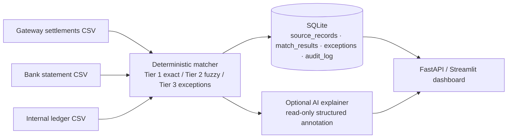

# Reconcio Architecture

```mermaid
flowchart LR
  G[Gateway settlements CSV] --> M[Deterministic matcher\nTier 1 exact / Tier 2 fuzzy / Tier 3 exceptions]
  B[Bank statement CSV] --> M
  L[Internal ledger CSV] --> M
  M --> S[(SQLite\nsource_records · match_results · exceptions · audit_log)]
  M --> E[Optional AI explainer\nread-only structured annotation]
  S --> A[FastAPI / Streamlit dashboard]
  E --> A
```

The AI explainer runs after matching, accepts only an exception object, and has no import or code path that can modify match results.
